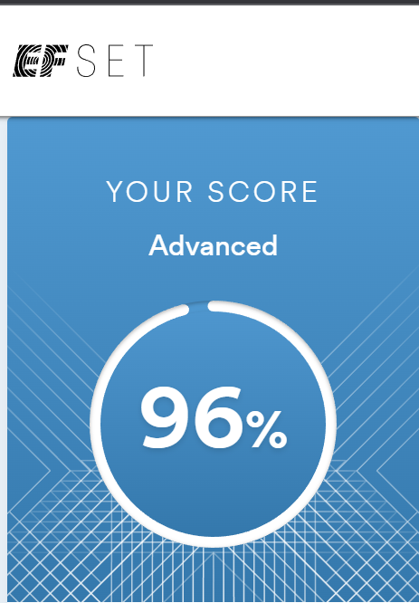

## [rsschool-cv](https://annabegisheva.github.io/rsschool-cv/cv)

---

# Anna Begisheva

---

Junior Frontend Developer

---

### Contact information:

**Phone:** +7 999 999 99 99  
**E-mail:** annabegisheva@gmail.com  
**Discord:** AnnaB (@AnnaBegisheva)

---

### Briefly About Myself:

Having started my career as a media planner in an international media agency with minimum skills, I became profficient in media planning. My keen interest in planning and strategy led me to working as a Senior for a huge FMCG company, where I continued to leverage my expertise and gained following achievements:
• Successful launch of new oral care brand,
• Execution of bonus social campaign that was named as one of the Agency’s most valuable contribution to channel planning in 2020 and resulting in official letter of thanks for the team from client’s CEO,
• Client satisfaction growth on troublesome account according to client’s bi-monthly assessment.

Experience in media planning let me develop some usefull for frontender skills such as working in team, good communicational skills, accuracy and time management.
I believe, that my ability to learn and to gain new skills will lead me through this path of becoming a proficient Frontend Developer.

---

### Skills:

- HTML5, CSS3, Sass
- JavaScript Basics
- React Basics
- Git, GitHub
- VS Code
- Figma

### Projects:

- pet-project for Curved timeline with CSS (<https://github.com/AnnaBegisheva/ITGirls/tree/main/timeline>)
- group project for "My Nanny" site (<https://github.com/AnnaBegisheva/ITGirls/tree/main/week11-12/myNanny>)
- group project for e-shop Felis (<https://mrglk.github.io/projectShop/>)
- study project for React app Flashcards - work in progress (<https://github.com/AnnaBegisheva/ITGirls/tree/main/study-cards-app>)

### Code examples:

```
function Plan(props) {
return (

<div
onClick={props.onClick}
className={`plan ${props.selected ? "selected" : ""}`} >
<header className={`plan__header ${props.theme.plan__header}`}>
{props.title}
</header>
<div className={`plan__price ${props.theme.plan__price}`}>
<p className="plan__priceValue_upper">руб</p>
<p className="plan__priceValue">{props.price}</p>
<p className="plan__priceValue_lower">/мес</p>
</div>
<div className="plan__speed">{props.speed}</div>
<footer className="footer">Объем включенного трафика не ограничен</footer>
</div>
);
}

function App() {
const themes = [themeA, themeB, themeC, themeD];
const [selected, setSelected] = useState(false);

return (

<div className="App">
<header className="App-header">
Наши тарифы
</header>
<div className="plans">
{
data.map((plan, i) =>
<Plan title={plan.title} price={plan.price} speed={plan.speed} theme={themes[i]} selected={selected === i} onClick={() => setSelected(i)}></Plan>
)
}
</div>
</div>
);
}

export default App;
```

### Experience:

Acted as a team member within 3 study projects:

- Book e-shop (HTML, SCSSS, study project)
- My Nanny site (HTML, SCSSS, charity project for social organization, includes communication with client)
- E-shop Felis website (HTML, SCSSS, Javascript study project)

Also working on React app within studing in ITGirls school

### Eduction:

ITGirls school Frontend course ( HTML, CSS, basic JS, React)

### Languages:

English - Upper Intermediate - Advanced (according to the online test at EFset (<www.efset.org>)),

Russian - Native
